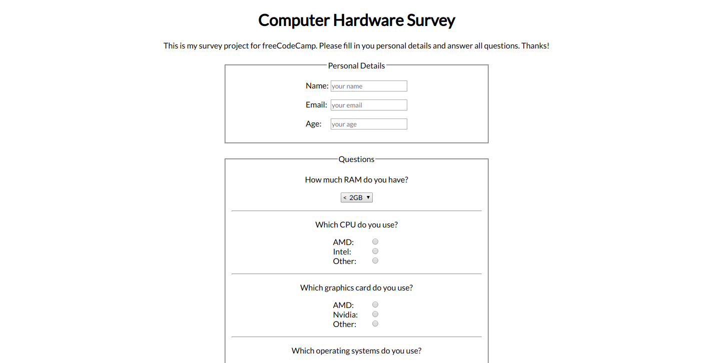

# Survey Form

## Introduction
A survey form about computer hardware.

This project is part of freeCodeCamps Data Visualization certificate.

## Project Requirements
* There is a title with id="title" in H1 sized text.
* There is a short explanation with id="description" in P sized text.
* There is a form with id="survey-form".
* Inside the form element, I am required to enter my name in a field with id="name".
* Inside the form element, I am required to enter an email in a field with id="email".
* Entering an email that is not formatted correctly shows a HTML5 validation error.
* A number can be entered in a field with id="number" inside the form.
* Entering non-numbers in the number input shows an HTML5 validation error.
* Entering numbers outside the range of the number input, which are defined by the min and max attributes, shows an HTML5 validation error.
* For the name, email, and number input fields inside the form are corresponding labels that describe the purpose of each field with the following ids: id="name-label", id="email-label", and id="number-label".
* For the name, email, and number input fields are placeholder texts that give a description or instructions for each field.
* Inside the form element, I can select an option from a dropdown that has a corresponding id="dropdown".
* Inside the form element, I can select a field from one or more groups of radio buttons. Each group should be grouped using the name attribute.
* Inside the form element, I can select several fields from a series of checkboxes, each of which must have a value attribute.
* Inside the form element, I am presented with a textarea at the end for additional comments.
* Inside the form element, I am presented with a button with id="submit" to submit all my inputs.

## Final Project
https://myrmidonut.github.io/fcc_responsive_survey_form

## Preview Images
### Main Screen:

